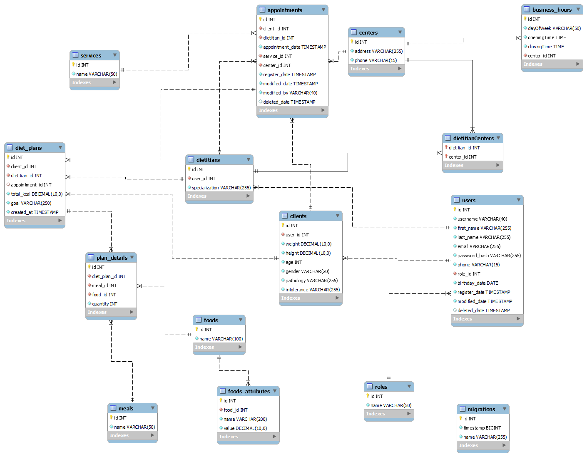

# Software Nutricional - Backend

## Diagrama DB

## Descripción del Proyecto

Este proyecto se centra en el desarrollo del backend para un sistema de gestión de citas destinado a un Software Nutricional. El objetivo principal es proporcionar a los clientes la capacidad de registrarse, realizar el inicio de sesión, acceder a su área personal, gestionar citas y ver información sobre dietistas. Además, se incluyen funcionalidades extra para roles de superadmin y validaciones adicionales.

### Funcionalidades Principales

1. **Usuarios**
   - Registro de usuarios.
   - Inicio de sesión de usuarios.
   - Perfil de usuario.
   - Modificación de datos del perfil.

2. **Citas**
   - Creación de citas.
   - Edición de citas.
   - Eliminación de citas.
   - Visualización de todas las citas como cliente (solo las propias).
   - Visualización de todas las citas existentes con el dietista (role dietista).

3. **Dietistas**
   - Listar dietistas.
   - Listar dietistas por centro (Extra).

### Funcionalidades Adicionales (Extra)

1. **Administración de Usuarios (Superadmin)**
   - Visualización de todos los clientes registrados.
   - Creación de dietistas.
   - Eliminación de usuarios del sistema.

2. **Detalles de Citas (Extra)**
   - Visualización detallada de una cita.

3. **Administración de Roles (Superadmin)**
   - Asignación de roles a los usuarios del sistema.

4. **Validaciones Adicionales (Extra)**
   - Validación de la fecha de la cita.
   - Añadir tipos de intervención (servicios) a las citas.

## Tecnologías Utilizadas

- TypeOrm.
- ES6, TypeScript.
- Uso de promesas y funcionalidad async/await.

## Estructura del Repositorio

- Se utiliza github para organizar el desarrollo con ramas específicas.
- Commits regulares y descriptivos para reflejar la evolución del proyecto.

## Instrucciones para Instalación Local

1. Clona este repositorio: `git clone https://github.com/monicasilvaa/proyecto4`
2. Instala las dependencias: `npm install`
3. Configura la base de datos (TypeOrm).
4. Para ejecutar las migraciones: `db:migration`
5. para ejecutar los seeders: `db:seeder`
6. Para borrar las tablas, ejecutar migraciones y seeders: `db:refresh`
7. Para la ejecución de la aplicación en desarrollo: `npm run dev`
8. Ejecuta la aplicación: `npm start`

## Endpoints

- **Registro de Usuarios**: `POST /auth/register`
- **Inicio de Sesión**: `POST /auth/login`
- **Perfil de Usuario**: `GET /api/users/`
- **Modificación de Datos del Perfil**: `PATCH /api/user//profile/:id`
- **Creación de Citas**: `POST /api/appointments`
- **Edición de Citas**: `PATCH /api/users/:id`
- **Eliminación de Citas**: `DELETE /api/appointments/:id`
- **Visualización de Citas como Cliente**: `GET /api/users/myAppointments`
- **Visualización de Citas con dietista**: `GET /api/users/dietitianAppointments`
- **Listar dietistas**: `GET /api/users/dietitians`
- **Listar dietistas por Centro (Extra)**: `GET /api/users/dietitians/:centerId`

## Objetivo

Este proyecto tiene como objetivo proporcionar un backend sólido y eficiente para el sistema de gestión de citas, cumpliendo con los requisitos del cliente y permitiendo futuras expansiones.

## Sobre el Proyecto

Este es el proyecto final a realizar para el Bootcamp Geekshubs, destinado a desarrollar las habilidades en el manejo de tecnologías backend, bases de datos y buenas prácticas de desarrollo.

